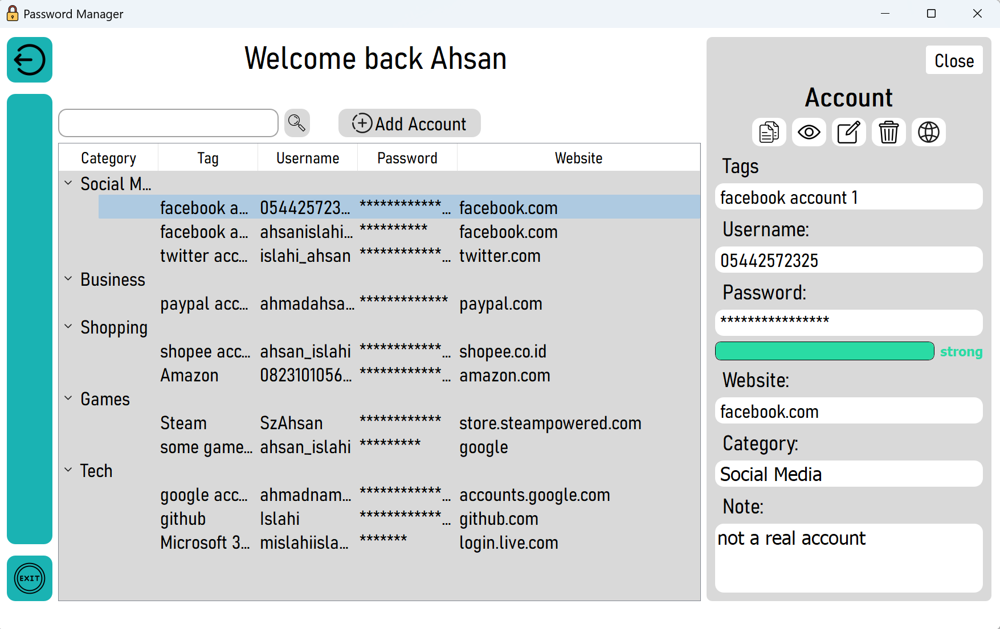
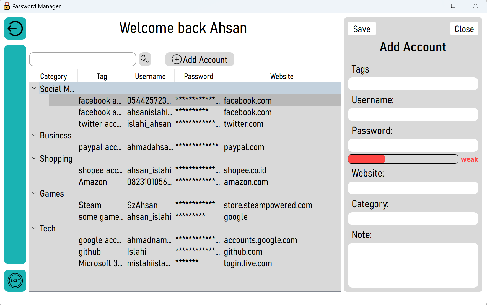
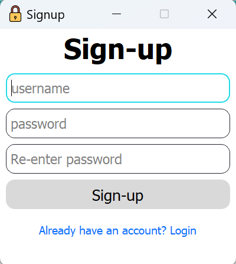
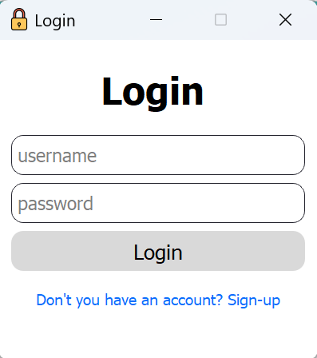

<h1 align= 'center'> Simple PyQt5 Password Manager</h1>

This password manager is built on a PYQT5 graphical user interface, utilizing the cryptography and SqlAlchemy libraries for enhanced security and efficient data management.

## Table of Contents

<ul>
	<li><a href="#features">Features</a></li>
	<li><a href="#screenshoots">Screenschots</a></li>
	<li><a href="#installation">Installation</a></li>
	<li><a href="#project-workflow-overview"> Project Workflow Overview</a></li>
	<li><a href="#contributing">Contributing</a></li>
	<li><a href="#to-do">To do</a></li>
	<li><a href="#known-issues">Known Issues</a></li>
</ul>


## Features

- **Multi-User Login:** Securely manage passwords for multiple users.
- **Encrypted Passwords and Notes:** Ensure the confidentiality of your sensitive information.
- **Password Strength Check:** Validate the strength of your passwords for robust security.
- **Intuitive GUI:** Enjoy a user-friendly interface for a seamless experience.

## Screenshoots




## Installation

To use the password manager, make sure you have the following dependencies installed:

- PyQt5
- cryptography
- SQLAlchemy

You can install these dependencies using the following command:

### 1. Using Pip (Recommended)

```bash
pip install -r requirements.txt
```

This command will install all the required libraries listed in the `requirements.txt` file.

### 2. Manual Installation

If you prefer to install the libraries manually, you can use the following commands:

- **PyQt5:**
  ```bash
  pip install PyQt5
  ```

- **cryptography:**
  ```bash
  pip install cryptography
  ```

- **SQLAlchemy:**
  ```bash
  pip install SQLAlchemy
  ```

Make sure to update the version numbers and package names as needed. 

## Project Workflow Overview

Explore the functionality of the Simple PYQT5 Password Manager with the following insights:

**Initialization:**

Launch the program and provide a new username and password during the first-time setup.

**Database Creation:**

Upon the initial setup, the program generates a dedicated database file named `database.db`. Within this database, two essential tables are created:

- **User Login Information Table:**
  
  Holds crucial details, including the username, hashed password, and encryption key.

- **User Data Table:**
  
  Stores all the information that users save within the program.

**Understanding User Login Table:**

The User Login Information Table plays a pivotal role in user authentication and security.

**User Data Storage:**

The User Data Table efficiently manages and organizes all user-saved data.

**Important Note:**

Deleting the `database.db` file will result in the permanent removal of all login information and saved data. Exercise caution when handling this file.

By grasping these fundamental insights, users can efficiently and securely utilize the features offered by the password manager.

## Contributing

If you'd like to contribute to the project, follow these steps:

1. Fork the repository.
2. Create a new branch (`git checkout -b feature/new-feature`).
3. Commit your changes (`git commit -m 'Add new feature'`).
4. Push to the branch (`git push origin feature/new-feature`).
5. Open a pull request.

## To Do

* Add keypress events
* encrypt `database.db` file
* Incorporate all special characters from the ASCII character set to assess the password strength

## Known Issues

- When accessed on devices with lower screen resolution, all fonts are reduced in size.

Feel free to explore, contribute, and enhance this project
